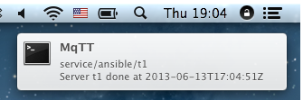

# MQTT-OSX-NOTIFIER

Subscribes to any number of MQTT topics and notifies to the OSX notification
area (whatever that may be called officially ...)



Configuration is expected in the `mqtt-osx-notifier.ini` file (a sample template is
provided, which has to be renamed):

```ini
[notifier]
application=MQTT

[mqtt]
broker=localhost
port=1883

[topics]
topic1 = test/one
topic2 = twitter/emergency
topic3 = jp/#
```

You can specify any number of topics in the `[topics]` section; the key name
is ignored.

`mqtt-osx-notifier` connect to the specified MQTT broker and subscribes to the list
of topics. For each message received on a topic, `mqtt-prowl` will notify
your OSX.

Publish a test message to your broker, specifying one of the topics `mqtt-osx-notifier` is
subscribed to:

```
mosquitto_pub -t test/one -m 'Introducing mqtt-osx-notifier. :-)'
```

After a few seconds, you should see the result on the top-right of your OSX machine.

## Requirements

* [pync](https://github.com/setem/pync) which uses the binary `terminal-notifier`. Note:
  upon first launch, `pync` will download and extract `https://github.com/downloads/alloy/terminal-notifier/terminal-notifier_1.4.2.zip` into a directory `vendor/`.
